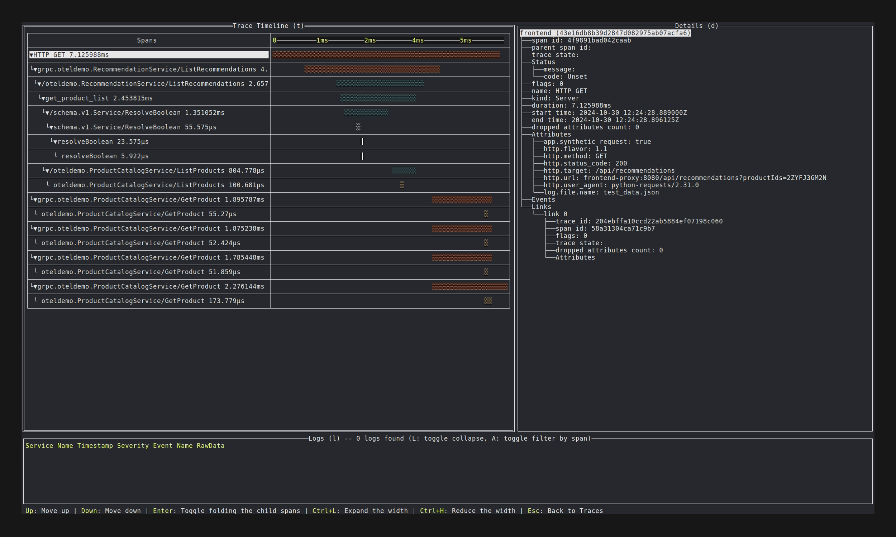
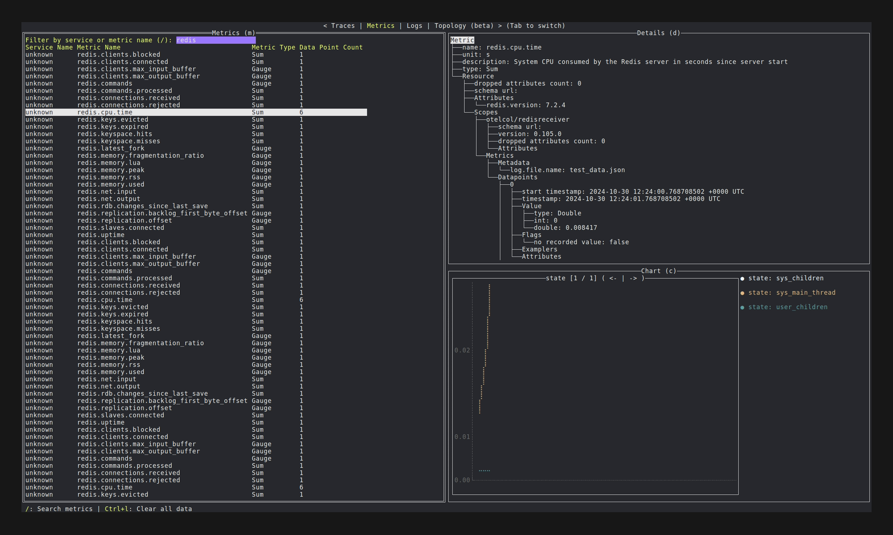

# otel-tui

A terminal OpenTelemetry viewer inspired by [otel-desktop-viewer](https://github.com/CtrlSpice/otel-desktop-viewer/tree/main).

This tool currently supports OpenTelemetry, Zipkin (Traces) and Prometheus (Metrics) formats.

Traces



Metrics


Logs


## Getting Started
Currently, this tool exposes the ports:
- `4317` to receive OpenTelemetry signals (gRPC)
- `4318` to receive OpenTelemetry signals (HTTP)
- `9411` to receive Zipkin traces (enabled by `--enable-zipkin` option)

Options:

```
Usage:
  otel-tui [flags]

Flags:
      --enable-prom               Enable the prometheus receiver
      --enable-zipkin             Enable the zipkin receiver
      --grpc int                  The port number on which we listen for OTLP grpc payloads (default 4317)
  -h, --help                      help for otel-tui
      --host string               The host where we expose our OTLP endpoints (default "0.0.0.0")
      --http int                  The port number on which we listen for OTLP http payloads (default 4318)
      --prom-target stringArray   The target endpoints for the prometheus receiver (--prom-target "localhost:9000" --prom-target "other-host:9000")
  -v, --version                   version for otel-tui
```

### Homebrew

```sh
$ brew install ymtdzzz/tap/otel-tui
```

### go install

```sh
$ go install github.com/ymtdzzz/otel-tui@latest
```

### Docker

Run in the container simply:

```sh
$ docker run --rm -it --name otel-tui ymtdzzz/otel-tui:latest
```

Or, run as a background process and attach it:

```sh
# Run otel-tui as a background process
$ docker run --rm -dit --name otel-tui ymtdzzz/otel-tui:latest

# Show TUI in your current terminal session
$ docker attach otel-tui

# Detach by pressing Ctrl+p -> Ctrl+q
```

### Docker Compose

First, add service to your manifest (`docker-compose.yaml`) for the instrumanted app

```yml
  oteltui:
    image: ymtdzzz/otel-tui:latest
    container_name: otel-tui
    stdin_open: true
    tty: true
    # Override entrypoint if you want use options
    entrypoint: ["/otel-tui", "--enable-zipkin"]
```

Modify configuration for otelcol

```yml
exporters:
  otlp:
    endpoint: oteltui:4317
service:
  pipelines:
    traces:
      exporters: [otlp]
    logs:
      exporters: [otlp]
```

Run as a background process and attach it:

```sh
# Run services as usual
$ docker compose up -d

# Show TUI in your current terminal session
$ docker compose attach oteltui

# Detach by pressing Ctrl+p -> Ctrl+q
```


### Executable Binary from Github Release page

https://github.com/ymtdzzz/otel-tui/releases

### From Source

```sh
$ git clone https://github.com/ymtdzzz/otel-tui.git
$ cd otel-tui
$ go run ./...
```

## TODOs

There're a lot of things to do. Here are some of them:

- Traces
  - [x] Display traces
  - [x] Filter traces
  - [x] Show trace information
- Metrics
  - [x] Metric stream
    - [x] Display metric stream
    - [x] Filter metrics
    - [x] Show metric information
    - [ ] Display basic chart of the selected metric
      - [x] Gauge
      - [x] Sum
      - [x] Histogram
      - [ ] ExponentialHistogram
      - [ ] Summary
  - [ ] Metric list
    - [ ] Display metric stream
    - [ ] Flexible chart (query, selectable dimensions, etc.)
  - [ ] Auto refresh chart
  - [ ] Asynchronous chart rendering
- Logs
  - [x] Display logs
  - [x] Filter logs
  - [x] Show log information
  - [x] Show logs related to a specific trace or span
- UI
  - [ ] Improve UI
  - [ ] Add more keybindings
- Performance
  - [x] Timer based refresh
  - [x] Data rotation (current buffer size: 1000 service root spans and logs)
- Configurations
  - [x] Port
  - [ ] Refresh interval
  - [ ] Buffer size

## Contribution

Contributions are always welcome! Whether it's reporting an issue, suggesting a feature, or submitting a pull request, your involvement is greatly appreciated. Below is a simple guide to help you get started.

### Creating a Pull Request

####  Fork the Repository 

- Start by forking this repository to your GitHub account.

#### Make Your Changes

- Implement your changes in a new branch.

#### Write Tests

- Add tests to verify your changes. This helps ensure the stability of the project.

#### Run Lint checks and Tests

- Run the linting tools and test suite to verify your changes. Make sure everything passes before proceeding.

```
make lint
make lint-exporter
make test
make test-exporter  
```

#### Open a Pull Request

- Push your branch to your forked repository.
- Open a pull request to the main repository, providing a clear description of your changes and their purpose.

Thank you for taking the time to contribute!
